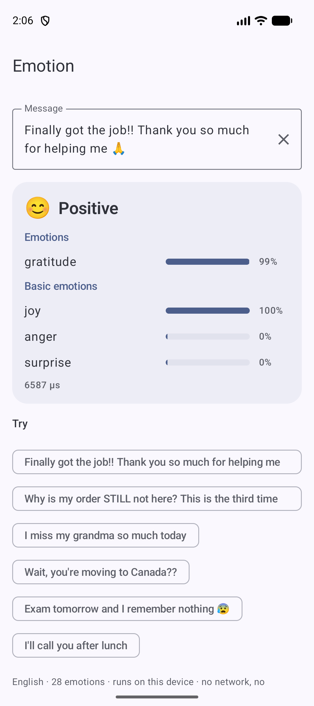
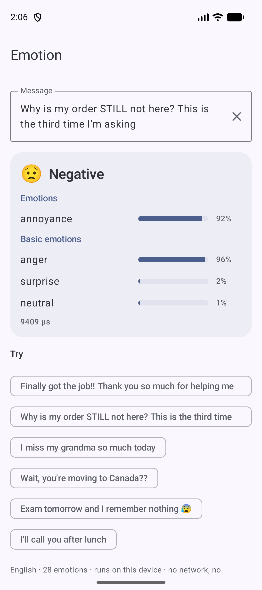
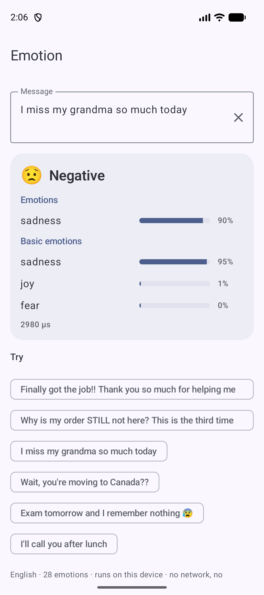
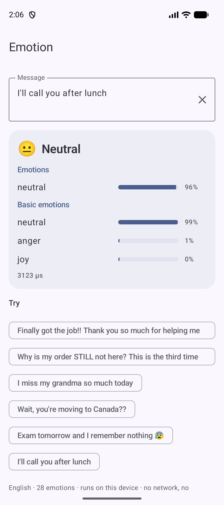
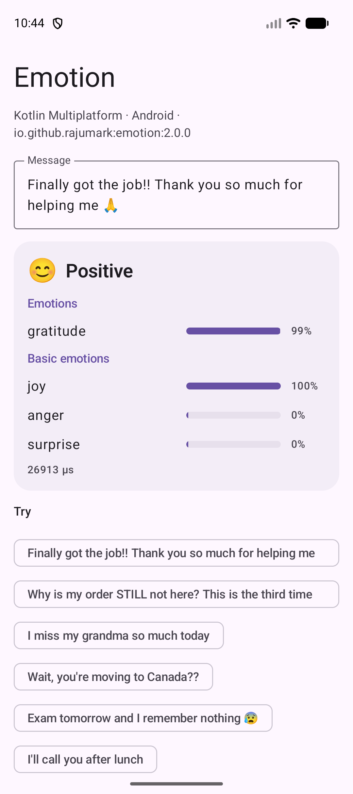
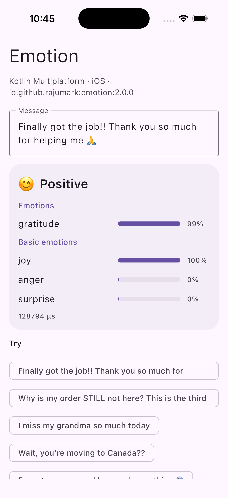
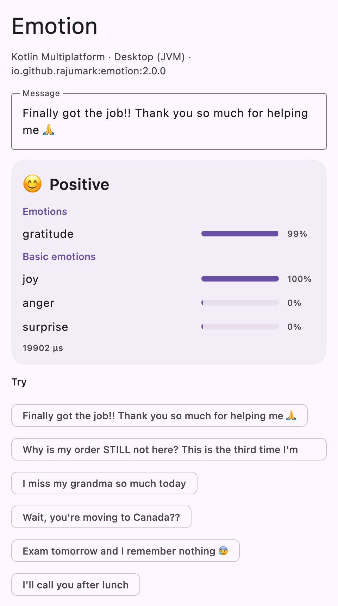
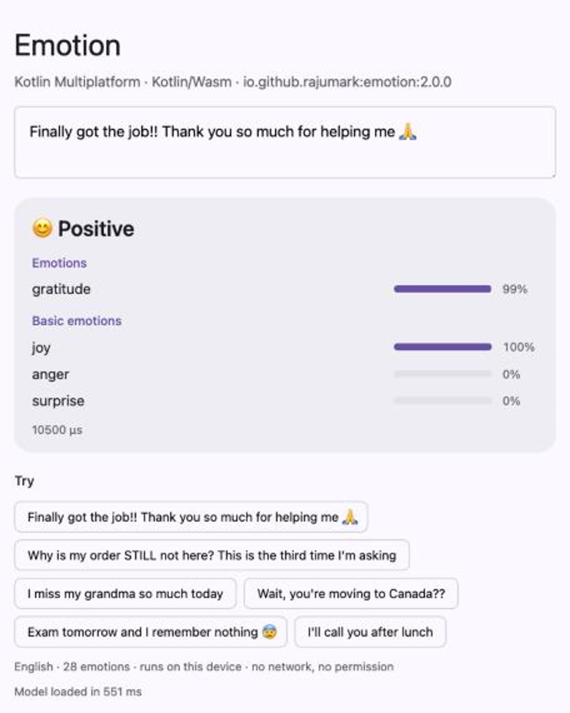

# Emotion 😊

**[Website](https://rajumark.github.io/emotion/)** · **[All Hoverfly models](https://rajumark.github.io/hoverfly/#models)** · [Maven Central](https://central.sonatype.com/artifact/io.github.rajumark/emotion)

By [Hoverfly](https://rajumark.github.io/hoverfly/). On-device emotion detection for **Kotlin Multiplatform**: Android, iOS, macOS, JVM desktop, JavaScript and WebAssembly. It reads an English message and tells you which emotions it
carries, several at once: joy, gratitude, anger, sadness, nervousness and 23 more, plus an overall mood.

```kotlin
import io.github.rajumark.hoverfly.emotion.Emotion

Emotion().use { emotion ->
    emotion.detect("Exam tomorrow and I remember nothing 😰")
    // Result(mood=NEGATIVE, emotions=[nervousness 0.96])
    emotion.detect("Why is my order STILL not here? This is the third time I'm asking")
    // Result(mood=NEGATIVE, emotions=[annoyance 0.92])
}
```

- **28 emotions, several at once.** The 27 [GoEmotions](https://github.com/google-research/google-research/tree/master/goemotions)
  emotions plus neutral, each with a score and its own tuned threshold. Also a mood (positive, negative, ambiguous,
  neutral) and Ekman's six basic emotions.
- **Made for everyday messages.** It also reads emotions that are implied, not named: *"waiting outside the
  principal's office"* is nervousness, *"the scan came back clear"* is relief. Emojis and slang are understood.
- **No dependencies.** Inference is plain Kotlin. There is no ONNX Runtime, TFLite, ML Kit or native code; the model
  adds about 6.5 MB to an app.
- **Private and offline.** The model ships inside the library on every platform. There is no network, no permission and no telemetry.
- **Fast.** About 3–5 ms per message on an Android emulator once warm; the model loads in about 250 ms.
- **minSdk 21.** Works from Kotlin and Java. English only.

## Install

```kotlin
// build.gradle.kts: commonMain, or any platform source set
dependencies {
    implementation("io.github.rajumark:emotion:2.0.0")
}
```

It's on Maven Central, so no extra repository is needed. Gradle picks the right artifact for each platform:

| Platform | Artifact |
|---|---|
| Android (minSdk 21) | `emotion-android` |
| JVM desktop (Java 8+) | `emotion-jvm` |
| iOS device and simulator (arm64) | `emotion-iosarm64`, `emotion-iossimulatorarm64` |
| macOS (arm64) | `emotion-macosarm64` |
| JavaScript (browser, Node) | `emotion-js` |
| WebAssembly (browser, Node) | `emotion-wasm-js` |

The Android-only 1.x releases are on JitPack: `com.github.rajumark:emotion:v1.x`.

Upgrading from 1.x on Android: `Emotion(context)` still compiles in Kotlin (deprecated). The model no longer needs a `Context`, so switch to `Emotion()`. Java code must change `new Emotion(context)` to `new Emotion()`.

## Screenshots

The sample app on an emulator. Every result is computed on the device.

| Gratitude | Annoyance | Sadness | Neutral |
|---|---|---|---|
|  |  |  |  |
| "Finally got the job!! Thank you so much for helping me 🙏" | "Why is my order STILL not here? …" | "I miss my grandma so much today" | "I'll call you after lunch" |

The KMP sample on each platform:

| Android | iOS | Desktop | Web (Wasm) |
|---|---|---|---|
|  |  |  |  |

## Use

```kotlin
import io.github.rajumark.hoverfly.emotion.Emotion
import io.github.rajumark.hoverfly.emotion.Label
import io.github.rajumark.hoverfly.emotion.Mood

val emotion = Emotion()          // loads the model: do it off the main thread, keep one instance

val r = emotion.detect("Finally got the job!! Thank you so much for helping me 🙏")
r.emotions      // [gratitude 0.99]            labels above their thresholds, best first, never empty
r.top           // Label.GRATITUDE
r.mood          // Mood.POSITIVE
r.basic[0]      // joy 1.00                    Ekman's basic emotions, best first
r.all           // all 28 labels with scores, best first

if (r.mood == Mood.NEGATIVE) { /* a kinder reply, a human agent, a softer UI */ }
if (r.emotions.any { it.label == Label.NERVOUSNESS }) { /* "you've got this!" */ }

emotion.close()                         // frees the model's memory
```

`detect()` is thread-safe. A blank message is neutral.

With coroutines:

```kotlin
val emotion = withContext(Dispatchers.Default) { Emotion() }
```

From Java:

```java
try (Emotion emotion = new Emotion()) {
    Result r = emotion.detect("I miss my grandma so much today");
    if (r.getMood() == Mood.NEGATIVE) { /* ... */ }
}
```

### API

| | |
|---|---|
| `Emotion()` | Loads the bundled model. `AutoCloseable`. |
| `detect(text)` | Returns a `Result`. |
| `Result(emotions, all, basic, mood)` | `emotions`: labels that pass their thresholds, best first (at least one). `top`: the most likely `Label`. |
| `Score(label, score)`, `BasicScore(emotion, score)` | Scores are 0..1. |
| `Label` | `ADMIRATION AMUSEMENT ANGER ANNOYANCE APPROVAL CARING CONFUSION CURIOSITY DESIRE DISAPPOINTMENT DISAPPROVAL DISGUST EMBARRASSMENT EXCITEMENT FEAR GRATITUDE GRIEF JOY LOVE NERVOUSNESS OPTIMISM PRIDE REALIZATION RELIEF REMORSE SADNESS SURPRISE NEUTRAL`; each has a `mood`. |
| `Mood` | `POSITIVE`, `NEGATIVE`, `AMBIGUOUS`, `NEUTRAL` (the mood of the top emotion) |
| `BasicEmotion` | `ANGER`, `DISGUST`, `FEAR`, `JOY`, `SADNESS`, `SURPRISE`, `NEUTRAL` |

## Quality

Two test sets, never used for training: **107 fresh everyday messages** written by hand after training (never used
to build, tune or choose a model; many carry an implied emotion), and the **GoEmotions test set** (5,427 Reddit
comments, several raters each). Each model gets its own per-emotion thresholds, tuned the same way on GoEmotions
validation.

| | Emotion | RoBERTa-base GoEmotions | MiniLM GoEmotions | ModernBERT-large GoEmotions |
|---|---|---|---|---|
| Fresh everyday messages: top emotion right | **38.3%** | 35.5% | 33.6% | 33.6% |
| Fresh everyday messages: mood right | **46.7%** | 40.2% | 43.0% | 35.5% |
| GoEmotions test: top emotion right | 61.0% | 63.6% | 60.6% | **66.2%** |
| GoEmotions test: macro-F1, 28 emotions | 0.475 | 0.522 | 0.510 | **0.538** |
| GoEmotions test: mood right | 70.3% | 73.7% | 72.5% | **75.4%** |
| Size | **6.4 MB** | 499 MB | 121 MB | 1.6 GB |
| Latency, one message, 1 CPU thread (laptop) | **~0.3 ms** | ~17 ms | ~2.6 ms | ~60 ms |

Emotions are subjective and messages often carry several, so no model is close to perfect; human raters disagree
too. On GoEmotions' own Reddit comments the large models are ahead. On everyday messages, where the emotion is often
implied rather than named, Emotion is ahead while being 78× smaller and 60× faster than RoBERTa-base.

**Where it falls short:** sarcasm (*"oh great, it's raining on my day off"*), subtle approval and disapproval, and a
few plain messages with times in them read as excitement (*"The meeting moved to 3 pm"*). Use the scores as signals,
not verdicts.

## Sample apps

`sample/` is a separate Gradle build that uses the **published** library, never the source. It resolves `io.github.rajumark` only from Maven Local, or from Maven Central with `-PemotionRepo=central`. It has a Compose Multiplatform app for Android, desktop and iOS, and a web page built for both Kotlin/JS and Kotlin/Wasm.

```bash
./gradlew :emotion:publishToMavenLocal
cd sample
./gradlew :androidApp:installRelease
./gradlew :desktopApp:run
./gradlew :webApp:wasmJsBrowserDevelopmentRun     # or :webApp:jsBrowserDevelopmentRun
open iosApp/iosApp.xcodeproj                       # run the iosApp scheme on a simulator
```

## Project layout

```
emotion/                       the library
  src/commonMain/              public API (Emotion, Result, Label, Mood, BasicEmotion) and the model in plain Kotlin
                               (internal/: Featurizer, SentencePiece, Network, UnicodeTables)
  src/{jvm,android,apple,js,wasmJs}Main/   the only platform code: NFKC normalization + model loading
  src/modelData/               emotion.bin (int8 weights) · spm_pieces.tsv (tokenizer) · thresholds.txt
  src/commonTest/              parity with the reference on 184 vectors, API, latency; runs on every target
sample/                        demo apps using the published artifacts
scripts/GenTables.java         generates UnicodeTables.kt (character classes) so every platform agrees
docs/                          website (rajumark.github.io/emotion)
```

On JVM and Android the model ships as Java resources in the jar/AAR. Kotlin/Native and the web have no resources, so the build compiles it into the library (`generateEmbeddedModel`).

## Tests

```bash
./gradlew :emotion:jvmTest
./gradlew :emotion:testAndroidHostTest
./gradlew :emotion:connectedAndroidDeviceTest              # on a connected device/emulator
./gradlew :emotion:iosSimulatorArm64Test
./gradlew :emotion:macosArm64Test
./gradlew :emotion:jsNodeTest :emotion:jsBrowserTest
./gradlew :emotion:wasmJsNodeTest :emotion:wasmJsBrowserTest
```

The parity tests require identical token and n-gram ids and all 28 + 7 probabilities within 0.002 of the reference implementation on all 184 vectors, on every target. The current maximum difference is 1.3e-6.

## How it works

Two streams read the message: hashed words, word pairs and character n-grams (robust to typos, slang and emojis), and
SentencePiece tokens through four small transformer layers with attention pooling. An MLP on both gives the 28
emotion scores and the 7 basic-emotion scores. Weights are int8 with one scale per row; the model has 6.0M
parameters.

It was trained on GoEmotions (Google, Apache 2.0), XED English and BRIGHTER English (CC BY 4.0), on about a million
everyday English sentences labelled by a large GoEmotions model it learned from, and on everyday chat sentences written
for emotions that GoEmotions models miss.

## Publishing

See [PUBLISHING.md](PUBLISHING.md).

## More Hoverfly models

Emotion is one of eight small on-device models by [Hoverfly](https://rajumark.github.io/hoverfly/), all with the same install, the same free tier and nothing sent to a server.

| Model | What it does | Source |
|---|---|---|
| 🙂 [Moji](https://rajumark.github.io/moji/) | Emoji suggestions in 22+ languages | [GitHub](https://github.com/rajumark/moji) |
| 🗼 [Beacon](https://rajumark.github.io/beacon/) | Language and script detection, Hinglish included | [GitHub](https://github.com/rajumark/beacon) |
| ✍️ [Comma](https://rajumark.github.io/comma/) | Punctuation and capitals for voice-typed text | [GitHub](https://github.com/rajumark/comma) |
| 💬 [Comeback](https://rajumark.github.io/comeback/) | Smart replies to tap | [GitHub](https://github.com/rajumark/comeback) |
| 🛡️ [Gatekeeper](https://rajumark.github.io/gatekeeper/) | Toxic message detection for Indian chat | [GitHub](https://github.com/rajumark/gatekeeper) |
| 🏚️ [Hideout](https://rajumark.github.io/hideout/) | Finds and hides phone numbers, UPI, Aadhaar and more | [GitHub](https://github.com/rajumark/hideout) |
| 🖍️ [Chalk](https://rajumark.github.io/chalk/) | Doodle recognition, 345 things from pen strokes | [GitHub](https://github.com/rajumark/chalk) |

See them all on the [Hoverfly website](https://rajumark.github.io/hoverfly/#models).

## Pricing & license

**Free for up to 10,000 monthly active devices.** You don't need an API key, an account or a license file: add the dependency and ship. It works in commercial apps too, with no limit on how often each device runs it.

| | Community | Commercial | Custom models |
|---|---|---|---|
| **Price** | Free | Contact us | Contact us |
| **For** | Products with up to 10,000 monthly active devices per platform | Products above 10,000 monthly active devices on any platform | A model trained for your own language, domain or task |
| **Includes** | Commercial use, unlimited calls, no key or sign-up | One license per product per model, direct support, early access to updates | Designed and trained by Hoverfly, shipped as a plain Kotlin library |

**How devices are counted.** A monthly active device is a device that runs Emotion at least once in a calendar month. The limit applies separately to each product, each platform (Android, iOS, web…) and each Hoverfly model. Once a product passes it, you have 30 days to get a commercial license. The library keeps working and never checks in with a server.

**Not allowed** under any tier (unless agreed in writing):

- selling or redistributing Emotion or its model on its own, or inside another SDK or library
- extracting, modifying, fine-tuning or retraining the model weights
- using the model or its outputs to train or distill another model
- reverse engineering the model or its file format
- offering it as a hosted API for others

**Custom models.** Hoverfly also designs and trains small, fast on-device models for your needs: moderation, classification, language detection, smart replies and more.

**Contact** for a commercial license or a custom model: [raju348636@gmail.com](mailto:raju348636@gmail.com) or **+91 63533 21951** (call or WhatsApp).

Full terms: [Hoverfly Community License](LICENSE).
